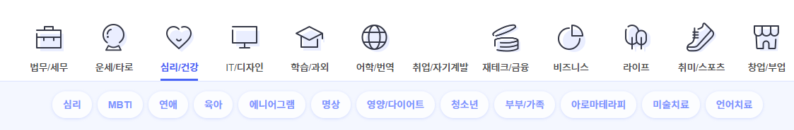
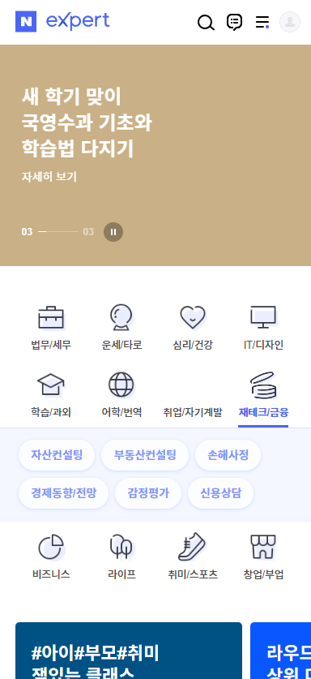

# [W1] 아이디어 중간 정리

Attendees: jyueong, 송수현, sairo, 리미,  leeym, ui seok oh
Created by: 리미
Created time: April 11, 2023 3:51 PM
Last edited by: jyueong
Last edited time: April 11, 2023 5:29 PM

# 인생은 실전이야

## 기획의도

- 기존 문제점
    - 지인이 없거나, 하는 커뮤니티가 없거나, 검색하면 가입해서 등업해야함
    - 삶의 꿀팁을 얻기 위해서 여기저기 흩뿌려진 정보를 수집하려면 여러 커뮤니티에 가입을 해야한다… 주변에 물어볼 사람이 없으면 배우기 힘들다… 그래서 모든 꿀팁을 이곳에 모아놨다!
- 학교에서는 가르쳐 주지 않는 세금, 보험, 계약, 생활법령 등 인생 꿀팁 공유
- 전문성 및 카테고리화 추가

## 기능

참고 : [https://m.expert.naver.com/](https://m.expert.naver.com/)

### 커뮤니티

- 신고, 필터 기능 - 특정 키워드 포함시 글 작성 불가
- 좋아요 순으로 보여주고 일정 신고수 이상 올라가면 블라인드
- 카테고리 별로 관련 커뮤니티 제공
- 커뮤니티에서 원하면 전문가 상담 요청
- 유저와 채팅
- 글 내용 기반으로 추천 해시태그 제공, 해시태그로 검색 가능

### 엑스퍼트, 전문가 연결

- 전문가와 상담 채팅
1. 전문 영역
    - 전문성 심사 관련 자격증 및 서류 제출하여 전문가 자격 부여
2. 비전문 영역
    - 커뮤니티에서 인기를 얻은 사람들 (명예의 전당)
    - 당연히 의뢰를 많이 얻을테니까 동기 부여

### 추가 기능

- 전문가와 화상 상담
- 온라인 결제 서비스
- 카테고리에 해당되는 꿀템 판매도 추가할 수 있으면 좋겠다
- AI - GPT 에게 질문해보기